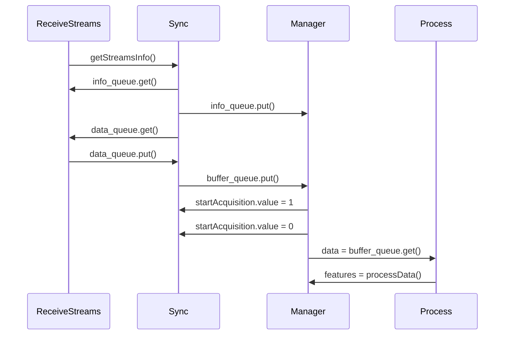

# 🪢 Loop System

This application is designed to retrive [Lab Streaming Layer](https://github.com/sccn/labstreaminglayer) streams for synchronization and processing.

## Here are a brief explanation of the functionality of each classes:

- `Streams` is a class that retrieves LSL streams. The `run()` method of this class is responsible for pulling samples from the stream, and adding them to a data queue.

- `ReceiveStreams` is a class that instantiates `Streams` objects for each available stream, and starts their processes. It also gets the stream information and puts it in an info queue.

- `Sync` is a class that retrieves data from the data queue and info queue, and synchronizes the data by timestamps. It also organizes the data in a dictionary, and puts it in a buffer queue at a specified time interval (30 seconds by default).

- `Processing` is a class that retrieves data from the buffer queue, and processes it to extract features. The extracted features are then returned.

- `Manager` is a class that instantiates `Sync` and `Processing` objects, and starts the `Sync` process. It also sets a flag to start data acquisition. The `run()` method in this class continuously retrieves data from the buffer queue and sends it for processing, until a specified elapsed time (2 minutes by default). When the elapsed time is reached, the data acquisition flag is set to `False`, and the `Sync` process is terminated.

