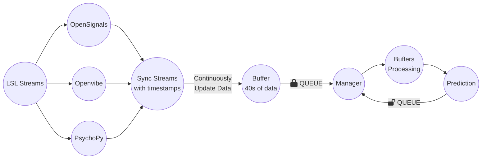
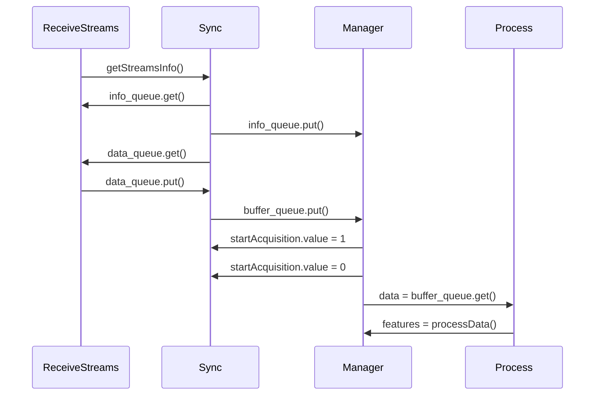

# 🪢 Loop System

## About

This application is designed to retrieve [Lab Streaming Layer](https://github.com/sccn/labstreaminglayer) streams
containing physiological data, synchronize and process the signals to obtain features in real-time.

The system uses parallel processing, therefore each class is a Process in Python.

## The following chart shows how the system works:

## Here are a brief explanation of the functionality of each class:

- `Stream` is a class that initializes all available LSL streams. The `run()` method of this class is responsible for
  pulling the samples
  from each stream, and adding them to a Queue.

- `ReceiveStreams` is a class that instantiates `Stream` objects for each available stream, and starts their processes.
  It also gets the stream information and puts it in a Queue.

- `Sync` is a class that retrieves data from the Queue of the class ReceiveStreams, and synchronizes the data by
  timestamps. It also organizes the data in a dictionary with keys matching the LSL Streams. Finally, it puts and
  continuously updates the data in a buffer
  queue with 40 sec of data and sends this data to the manager to process the features.

- `Processing` is a class of static methods that receives data from the buffer queue, and processes it to extract
  features. The extracted
  features are then returned in the Manager process.

- `Signals_Processing` is a class that contains all the static methods to process the physiological features.

- `Training Model` is a class that processes the physiological data and obtains the machine learning models during the
  training phase (calibration) of the system, to be used in real-time.

- `Manager` is a class that instantiates `Sync` and `Processing` objects, and starts the `Sync` process. It also sets a
  flag to start data acquisition. The `run()` method in this class retrieves data from the buffer queue (when there is a
  buffer available) and sends it for processing. Once there is a buffer being processed, the queue of buffers remains
  empty (the buffer is
  continuously updated in the `Sync` process) until it returns a prediction. This process is performed in a loop.

