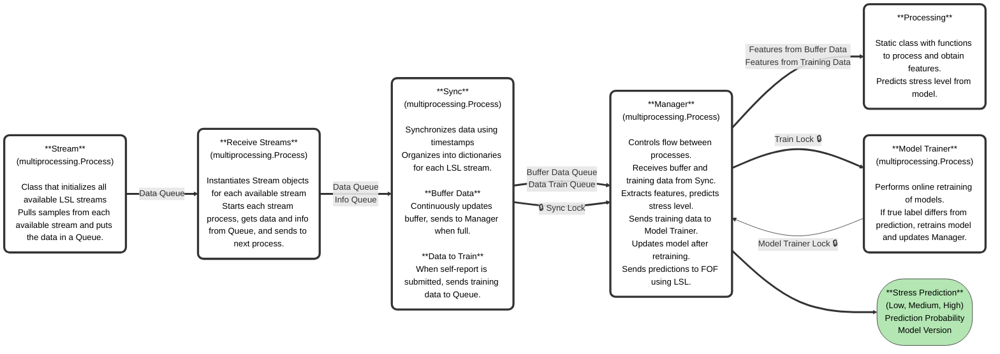
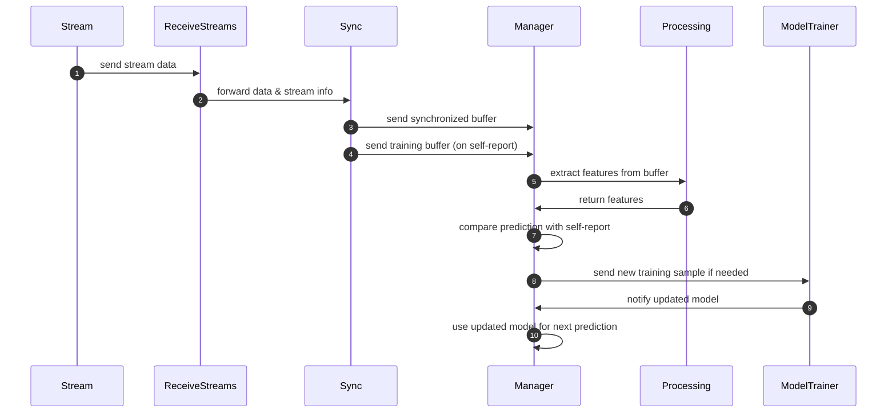

# 🪢 EmoLoop

## About

EmoLoop is a closed-loop framework designed to enable dynamic interaction between a user’s emotional state—measured
through physiological signals—and an adaptive VR environment. The system continuously monitors physiological signals
such as ECG, EDA, and respiration, synchronizes the data, extracts relevant features, and uses machine learning models
to predict the user’s emotional or stress state in real time. The framework is built on a modular parallel-processing
architecture, with each core component implemented as a separate
process for efficient, low-latency data acquisition and processing.

## The following chart shows how the system works:

## Here are a brief explanation of the functionality of each class:

`Stream (multiprocessing.Process)`

- This class initializes all available LSL streams, including OpenSignals and VR event markers.
  Its `run()` method continuously pulls data from each stream and places it into a shared Data Queue, enabling
  communication
  with the `ReceiveStreams` process.

`ReceiveStreams (multiprocessing.Process)`

- This class creates `Stream` objects for all available LSL streams at startup and starts each process.
  It collects data from their respective shared queues and manages data flow by placing the data and stream metadata
  into
  two separate shared queues (`Data Queue` and `Info Queue`) for further processing by the Sync process.

`Sync (multiprocessing.Process)`

- This class synchronizes data from the `ReceiveStreams` queue based on timestamps and organizes it into dictionaries
  for
  each LSL stream and physiological channel (ECG, EDA, RESP). Synchronized data is stored in a FIFO buffer with a fixed
  window size (e.g., 60 seconds).
  Once the buffer reaches the target size, it is placed into a shared `Buffer Data Queue` for communication with the
  `Manager`
  process. A lock (`Sync.Lock`) ensures concurrent access is prevented, and a `sendBuffer.value` flag controls the
  transmission of new
  data. For online retraining, a separate 60-second training buffer is maintained. When a participant submits a
  self-report, the
  data is sent to the `Data Train Queue`. Access to this buffer is controlled with a lock (`Sync.train_lock`) and a `Data
Available Event` flag.

`Manager (multiprocessing.Process)`

The `Manager` controls the overall system and orchestrates data flow between child processes. Retrieves data from
`Buffer Data Queue` while acquiring `Sync.Lock`.
Sends data to the `Processing` class for feature extraction and releases the lock when processing is complete. Sets
`sendBuffer.value` to True to allow the `Sync` process to transmit the latest buffer.
During online retraining:
Retrieves training data from `Data Train Queue`, extracts features, and compares predicted stress with the participant's
self-report.
If prediction ≠ self-report, a new training sample is placed in the `Sample Queue` for the `ModelTrainer` process, using
a
lock (`modelTrainer.lock`) and a `Sample Available Event`.
Output: predicted stress level, class probability, and model version in real time.

`Processing`

This class contains static methods for processing the buffered data and extracting features.
The signal-processing functions are consistent with the offline pipeline, ensuring feature validity.

`ModelTrainer (multiprocessing.Process)`

This class performs online retraining of the machine learning models.
Receives the current model and training data via the shared `Model Queue` from the `Manager`.
When a new training sample is available (prediction ≠ self-report), the model is retrained online.
A `Model Retrained Event` notifies the `Manager` that the model has been updated.
Access to the model is protected with a lock (`modelTrainer.lock`) to prevent concurrent modifications during
retraining.

